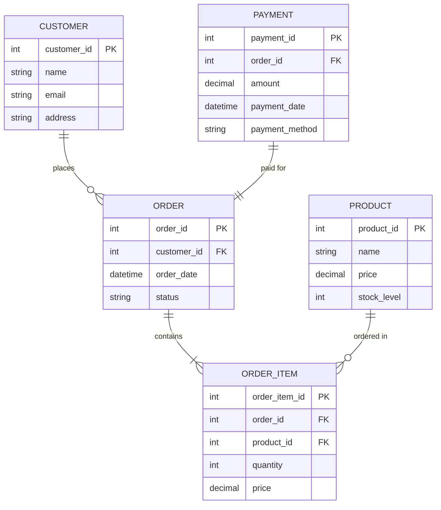
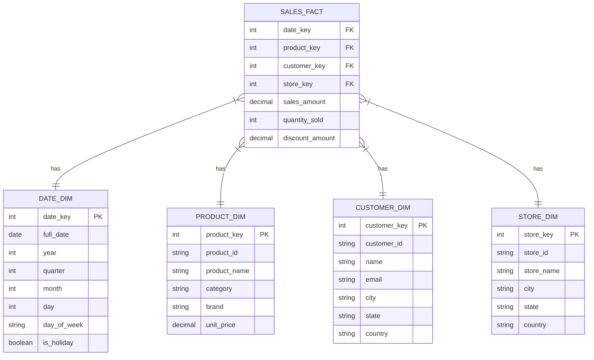
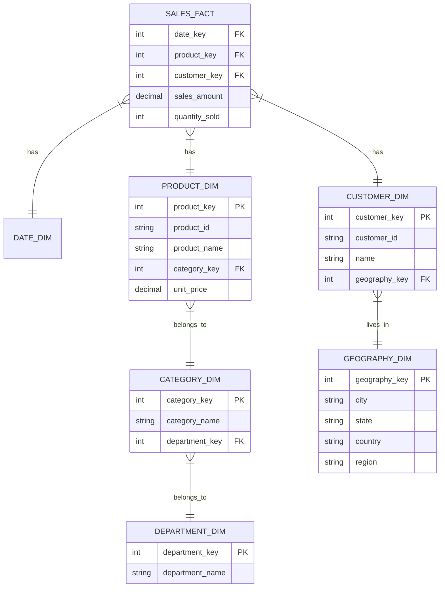

# OLAP vs OLTP: Understanding Database Design Paradigms

## Introduction

Database systems are generally designed for two primary purposes: transaction processing or analytical processing. This fundamental distinction drives different architectural choices, optimization strategies, and schema designs.

- **OLTP (Online Transaction Processing)**: Manages day-to-day operational data
- **OLAP (Online Analytical Processing)**: Supports complex analysis of business data

## Core Differences

| Feature | OLTP | OLAP |
|---------|------|------|
| Primary Purpose | Operational processing | Data analysis |
| Data Model | Highly normalized | Partially denormalized (dimensional) |
| Schema | Entity-Relationship | Star or Snowflake |
| Optimization | Write operations | Read operations |
| Query Complexity | Simple, predefined | Complex, ad-hoc |
| Record Access | Few records per query | Millions of records per query |
| Database Size | Gigabytes | Terabytes/Petabytes |
| Update Pattern | Regular small updates | Periodic bulk loads |
| Response Time | Milliseconds | Seconds to minutes |
| Users | Thousands (clerks, customers) | Hundreds (analysts, executives) |

## OLTP Systems

OLTP systems are designed to handle numerous concurrent transactions with high efficiency and reliability.

### Characteristics

- **Highly Normalized**: Tables are typically in 3NF (Third Normal Form) or higher
- **Transaction-focused**: Fast, frequent write operations
- **Fine-grained Data**: Individual records are processed quickly
- **ACID Compliance**: Ensures data integrity

### Schema Design

OLTP uses traditional entity-relationship modeling with highly normalized tables to minimize redundancy.



### Example Use Case

In an e-commerce application:
- Customer places an order
- Inventory levels are updated
- Payment is processed
- Order confirmation is sent

Each of these operations involves quick, targeted write operations across multiple normalized tables.

## OLAP Systems

OLAP systems are designed for complex analytical queries that need to examine large volumes of historical data.

### Characteristics

- **Dimensional Modeling**: Uses fact and dimension tables
- **Read-optimized**: Complex aggregations and analytical operations
- **Historical Data**: Stores large volumes of historical information
- **Query Flexibility**: Supports complex ad-hoc queries

### Schema Design

#### Star Schema

The most common OLAP schema design is the star schema, with a central fact table surrounded by dimension tables.



#### Snowflake Schema

The snowflake schema extends the star schema by normalizing dimension tables, creating a more complex but potentially more efficient structure for certain types of analysis.



### Slowly Changing Dimensions (SCD)

OLAP systems often need to track historical changes in dimension attributes. SCDs provide methods for handling these changes:

- **Type 1 SCD**: Overwrite old values (no history)
- **Type 2 SCD**: Create new records with effective dates
- **Type 3 SCD**: Add new columns for previous values
- **Type 4 SCD**: Use history tables
- **Type 6 SCD**: Hybrid approach (combines Types 1, 2, and 3)

### Example Use Case

A business analyst needs to:
- Compare regional sales performance over the last three years
- Identify top-selling products by customer demographic
- Analyze seasonal sales patterns

These complex analytical queries involve reading and aggregating large volumes of data from fact tables joined with multiple dimension tables.

## Implementation Differences

### OLTP Systems

```sql
-- Typical OLTP query: Find all orders for a specific customer
SELECT o.order_id, o.order_date, p.amount
FROM orders o
JOIN payments p ON o.order_id = p.order_id
WHERE o.customer_id = 12345
ORDER BY o.order_date DESC;
```

OLTP databases include:
- MySQL
- PostgreSQL
- Oracle
- SQL Server
- MongoDB (document-oriented)

### OLAP Systems

```sql
-- Typical OLAP query: Calculate quarterly sales by product category and region
SELECT 
    d.year,
    d.quarter,
    pc.category_name,
    g.region,
    SUM(s.sales_amount) as total_sales,
    COUNT(DISTINCT c.customer_key) as customer_count
FROM 
    sales_fact s
    JOIN date_dim d ON s.date_key = d.date_key
    JOIN product_dim p ON s.product_key = p.product_key
    JOIN product_category pc ON p.category_key = pc.category_key
    JOIN customer_dim c ON s.customer_key = c.customer_key
    JOIN geography_dim g ON c.geography_key = g.geography_key
WHERE 
    d.year BETWEEN 2021 AND 2023
GROUP BY 
    d.year, d.quarter, pc.category_name, g.region
ORDER BY 
    d.year, d.quarter, total_sales DESC;
```

OLAP databases include:
- Snowflake
- Amazon Redshift
- Google BigQuery
- Microsoft Analysis Services
- Apache Druid

## Data Flow: From OLTP to OLAP

In most organizations, data originates in OLTP systems and is periodically moved to OLAP systems for analysis:


The ETL (Extract, Transform, Load) or ELT (Extract, Load, Transform) process includes:
1. Extracting data from source OLTP systems
2. Transforming data to fit dimensional models
3. Loading data into the warehouse
4. Refreshing OLAP structures

## Summary

OLTP and OLAP represent different approaches to database design with distinct purposes:

- **OLTP**: Highly normalized for transactional efficiency
  - Optimized for write operations
  - Handles many small, simple transactions
  - Focuses on current operational data

- **OLAP**: Dimensional modeling for analytical capability
  - Optimized for read operations
  - Handles few complex analytical queries
  - Focuses on historical data for business intelligence

Understanding the differences between these paradigms is essential for designing effective database systems that meet specific business needs.